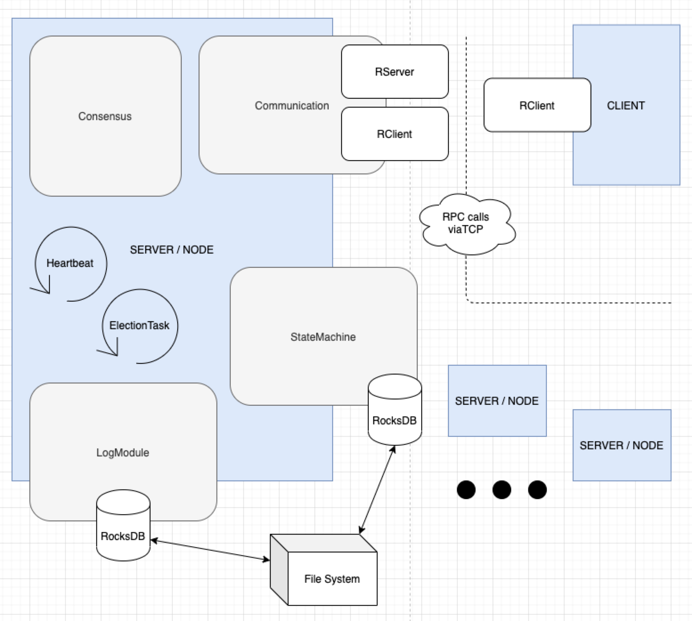
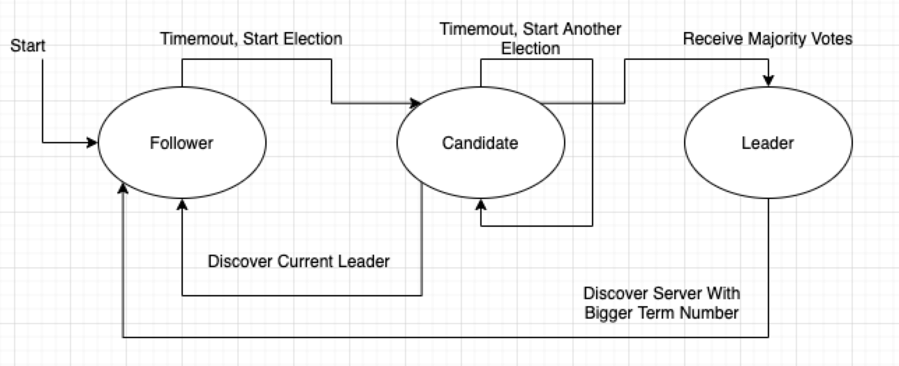

# cs7ns6-groupwork

CS7NS6 Distributed Systems 2019-20
Exercise 2

Implementing a Replicated Service Using Process Groups

Final Report by Chao Chen - 19310133

- [cs7ns6-groupwork](#cs7ns6-groupwork)
  - [Introduciton](#introduciton)
  - [Requirements](#requirements)
  - [Specifications](#specifications)
  - [Architecture](#architecture)
  - [Implementation](#implementation)
  - [Individual Contribution](#individual-contribution)
  - [Summary](#summary)
  - [Test](#test)
    - [How to](#how-to)
      - [Compile](#compile)
      - [Run](#run)
      - [Caveats](#caveats)
      - [Client Command](#client-command)
    - [Test Routine & Result](#test-routine--result)

## Introduciton

This project aim to implement a distributed key-value store based on the RAFT algorithm. The implementation is done with Java. The exact implementation, functionalities and architecture of this service will be discussed further throughout this document.

The work is based on RAFT protocol. A introduction about the RAFT algorithm can be found here: https://raft.github.io/

The original paper is [here](https://raft.github.io/raft.pdf) with the bibliography.

> Ongaro, Diego, and John Ousterhout. "In search of an understandable consensus algorithm." 2014 {USENIX} Annual Technical Conference ({USENIX}{ATC} 14). 2014.

```bib
@misc{ongaro2013search,
  title={In search of an understandable consensus algorithm (extended version)},
  author={Ongaro, Diego and Ousterhout, John},
  year={2013},
  publisher={Tech Report. May, 2014. http://ramcloud.stanford.edu/Raft.pdf},
  url={http://ramcloud.stanford.edu/Raft.pdf}
}
```

## Requirements

We are going to implement a distributed key-value store. One famous implementation is 'etcd' (https://github.com/etcd-io/etcd). The service, 'etcd', is a distributed key-value store for critical data, which are often the configurations for the cloud.

The read / write metrics are not the key concern in our requirements, as for configurations they are often accessed when one service in the cloud is initializing. What we do concern is the ability to provide non-stop services. It requires the system to have fault tolerance and the ability to resize dynamically
when on line. As for storage systems, data consistency is also important.

## Specifications

For service management:

- The group should be able to resize dynamically without stopping the service.
- The list of members of one group should be configurable, or be updated as the members joining or leaving.

For service operation:

- The service should accept concurrent requests from mulitple clients.
- Data should be persisted on disk instead of memory in case of node failures.

For replica failures:

- One node should be able to recognize failures from other nodes in the group.
- Failures from other nodes should be tolerated, while the function of the group remains normal.
- As mentioned in service operation section, Data should be persisted on disk, and should be able to recover when the node is back alive.
- Eventual consistency should be ensured.

For partitioning:

- The nodes should still be able to provide services when there is a network partition.
- N partitions (N >= 2) can be present, and they themselves should be organized.
- Eventual consistency should be ensured inside each partitions.

For client:

- Get/Set/Delete command should be able to execute on all the available nodes.
- Concurrent requests should be able to made via multiple clients.
- For test convinience, the client should be able to manage the network behavior of nodes in the service group (designed to test partitions).

## Architecture

Graph drawing using `draw.io` (https://app.diagrams.net/).



A big reason for using Java is that it provides a `synchronized` keyword to delare methods, preventing them to be invoked at the same time by multiple threads, or we can say the methods can be invoked when the thread get the lock.

Brief information about all the modules:

- Consensus
  - Contains logic for consensus feafure.
- Log Module
  - Provide access to the log entries of the node.
- Node Logic with Loops
  - Actuate the routine/lifecycle of a node under different states.
  - Handle/perform requests from conmunication.
- State Machine
  - Provide reliable key-value storage.
- Communication
  - Provide fundamental data transmition abilities and fault tolerance of network.
- Client
  - Give access to the data on the node, also provide utilities to do test.

There are 3rd party libraries involved in our project.

The communication is based on RPC calls. We use `sofa-bolt` from Alipay (https://github.com/sofastack/sofa-bolt). The connection is based on TCP with a compact data package defined by the library.

The storage is implemented with a built-in database library called `RocksDB` (https://github.com/facebook/rocksdb) from Facebook. The database is based on file system so we can persist the data and logs on the disk when nodes fail. Another feature is that the RocksDB get operation on single key is thread safe (https://github.com/facebook/rocksdb/wiki/Basic-Operations#concurrency) while for set operation we need to use external locks.

## Implementation

The node state decides the behavior across the modules. 3 states are divided for implementing the RAFT protocol.



The every node starts as a Follower. And in our implementation, the first node in the group, it will go through `start -> Follower -> Timeout, Start Election -> Candidate -> Recuive Majority Votes -> Leader`. Then the rest of nodes (real Followers) can join the group with the comunication with Leader (we will explain the resizing later).

Leader will handle all the Get/Set/Del(ete) operations from client, request to the Followers will be redirected to the Leader. For Set/Del operations, Leader will need to commit the changes to at least half of the nodes in the group. A log entry conatins a term number, a incremental index number and the operations performed on the database (State Machine), and client will receive the success result when harf of the nodes in the group commited the change.

---

The node maintains the `term` number of itself and a `commitIndex`. Term number is incremental for deciding the which node is up to date to become the Leader. `commitIndex` is the commited index number of log entries for the node itself.

There are two scheduled tasks running inside the node logic.

The heartbeat task only start from a Leader. In normal situation, when Follower receives the heartbeat from Leader, the election timeout will be reset (no need for election when Leader is alive). Term number and commitIndex from the leader are synced to the Followers.

The election task start when the Follower is not receiving the heartbeat from Leader. Followers and Candidates will vote for the requester if themselves' term number is less equal than the requester.

The leader keeps track of all the commitIndex numbers from Followers.

---

Beside timeouts for election and heartbeat, Node Logic also provide handlers from Communication module.

- handlerRequestVote: handling the vote request.
- handlerAppendEntries: handling the heartbeat and appending log entries.
- handlerClientRequest: handling Get/Set/Del request from client.
- handlerConfigChangeAdd: handling request to add a peer into the peer list.
- handlerGetConfig: handling request to get config (now for peer list only) from other node.
- handlerSetFail: For test use. Handling request to turn on/off failure simulation towards one peer.

Almost all the handler implementations with writes on the properties of the node are synchronized, which mean that a type of handler can be only invoked for 1 at a time.

---

The Consensus module, in charge of two functionality:

- `appendEntries`: evaluate the log entries sent from LEADER and append them to log module. To note that `appendEntries` will also handle heartbeat (heartbeat comes without log entries). Term numbers and index of the log entry are valuated and applied.
- `requestVote`: handling vote request from other Candidate.

---

The State Machine and Log Module provide similar functionalities towards storing and retrieving data, since both of them is implemented by wrapping RocksDB. Data and log entries are persisted on disk, so we can lower the risk of losing data when there is a node failure.

But when before adding a node or after deleting the node, we need to make sure whether the data and log entries remain on the disk are needed. The data will be recovered and may produce weird behavior on the index and data consistency.

---

A basic implementation of group resizing is done by adding and syncing the list of peers transmitted along with the heartbeat from leader:

1. Joining the group when start a node:
   1. Send a request to the leader and get the list of nodes in the group.
   2. Add itself to the list and send the **old and new** lists to the leader, then wait for heartbeat.
   3. After checking if the old list is the same as the the local one, leader will perform heartbeat as soon as it applys the new list.
   4. End of joining.
2. Leaving the group passively (when failure occurs):
   1. The node is deleted from leader's list of peers when fail to respond the heartbeat.
   2. A node will also be removed from the peers list of a follower if it fails to respond a RequestVote.

---

The client is implemented by continuous reading the input of the console. Multiple lines can be accepted and each line is processed by a thread in the thread pool (max=20, hardcoded), so we can copy prepared scripts into the console to do requests in batch. Commands of get/set/delete can be parsed and sent by specifying the target node with host and port. For test convinience, a setFail command is added to the requirement/specification for switch the simulation of node (network) failure from one node towards one other node in the group, hense we can manually build partitions by this command.

Also for test convinience we added a webpage GUI to perform request from client.

## Individual Contribution

- Being involved in technique selection.
- Implementing the node logic and loops, with concurrency features/thread pools.
- Implementing a rough version of dynamic group resizing.
- Implementing the client and test features (Without GUI).
- Tests.

## Summary

We implemented a rough distributed key-value store based on RAFT protocol. The system is built with considerations about concurrency, with locks and synchronized queues as the main concurrency model. Dynamic group building and resizing is managed. Data and log entries are persisted on disk. A leader election mechanism is implemented, and the leader take in charge of the decisions like commitment. Failures are tolerated and multiple partitions are supported.

There are still some future work remains. The dynamic resizing feature is rough and dangerous. In the RAFT paper (section 6), there is a solution with 2 phase commiting, in which the old and new verions of configurations are managed. Merging the partitions are still a problem. For log entries we did not do compaction. Much effort is needed for these aims.

## Test

### How to

#### Compile

Please use at least `jdk 1.8` to compile and run the program, with the MAVEN (`mvn`) toolchain installed.

To compile, run the compiling script `compile.sh` in the root of the project folder, a jar file `KVNode.jar` will appear at the root.

```text
$ sh compile.sh
```

#### Run

The builds of the code are divided into:

- client: with `-c` flag
- node (server): without `-c` flag and with valid configs

Use `-h` or `--help` command to access the help.

```text
$ java -jar KVNode.jar -h
usage: KVNode.jar
 -c,--client              Initiate as a client.
 -h,--help                Help
 -o,--host <arg>          The host of server
 -p,--port <arg>          The port of server listening to
 -t,--target-host <arg>   The host of target server to join, omit this or
                          target-port to establish a new group (as the first and
                          the leader)
 -y,--target-port <arg>   The port of target server to join, omit this or
                          target-host to establish a new group (as the first and
                          the leader)
```

To run client, use:

```text
$ KVNODENAME=CLIENT java -jar KVNode.jar -c
```

To run a server node, use: (where `4111` is the port listening, while `4110` is the target/leader port)

```text
$ KVNODENAME=4111 java -jar KVNode.jar -p 4111 -y 4110
```

The host/IP `localhost` is omitted.

The ENV variable `KVNODENAME` is for logs (both program log and log entries) and data persistence on the file system:

- `KVNODENAME.log`: program log / output
- `KVNODENAME_state/`: data storage
- `KVNODENAME_log/`: storage for log entries

#### Caveats

Do notice to start nodes **ONE BEFORE OTHERS** with LEADER - FOLLOWER order to establish the cluster.

For example:

1. start a server on port `4111` first (without the flag `-y`): `KVNODENAME=4111 java -jar KVNode.jar -p 4111`
2. Until `4111` is ready as a **LEADER**, start another server (`4112`) using: `KVNODENAME=4112 java -jar KVNode.jar -p 4112 -y 4111`
3. Repeat step 2 to add more nodes

Also be care about the RocksDB files remain in the file system. Since data and logs are persisted, it might bring impact to the experiment. Clean them before experiment.

#### Client Command

Program in client mode will read the lines input and parse the command.

`ip:port` is to determine which SERVER/NODE is going to communicate:

- `ip:port get KEY`
  - get a value using the `KEY`
- `ip:port set KEY VALUE`
  - set `VALUE` to the `KEY`
- `ip:port del KEY`
  - delete using the `KEY` (actually implemented with `ip:port set KEY null`)
- `ip:port setFail ip2:port2`
  - give no response (fail the request handling) to the server `ip2:port2`

For example, getting a value of key `foo` from a node(`localhost:4111`):

```text
localhost:4111 get foo
```

### Test Routine & Result

For easy recognition the log prefixes with dates and class names (`12:07:42.308 [pool-1-thread-2] INFO  life.tannineo.cs7ns6.App`) are omitted.

1. Start a 3-instance cluster with leader first decided, we can see without specifying the complete list of nodes/peers the cluster still can be built. And nodes in service can be terminated as you want. A simplified (also dangerous) dynamic management based on detecting connection failures (e.g. heartbeat) is implemented.

    ```text
    $ KVNODENAME=4111 java -jar KVNode.jar -p 4111          # as leader
    $ KVNODENAME=4112 java -jar KVNode.jar -p 4112 -y 4111
    $ KVNODENAME=4113 java -jar KVNode.jar -p 4113 -y 4111
    ```

2. Start a 3-instance cluster with leader first decided, use the client to execute the command *one by one*:

    ```text
    localhost:4112 get foo
    localhost:4111 set foo bar
    localhost:4113 get foo
    ```

    We can see that we can get / set on different nodes.

    ```text
    ...
    - You just input:
    localhost:4112 get foo
    - request content : foo, url : localhost:4112, put response : ClientKVAck(result=null)
    - get foo=null
    localhost:4111 set foo bar
    - You just input:
    localhost:4111 set foo bar
    - request content : foo=bar, url : localhost:4111, put response : ClientKVAck(result=ok)
    - set foo ok
    localhost:4113 get foo
    - You just input:
    localhost:4113 get foo
    - request content : foo, url : localhost:4113, put response : ClientKVAck(result=Command(opt=null, key=foo, value=bar))
    - get foo=bar
    ```

3. Close `localhost:4111`, wait for about 10 sec (election task timeout), the rest 2 nodes will go for election. Then update data on `localhost:4112`:

    ```text
    localhost:4112 set foo barbar
    ```

    When successed, start `localhost:4111` to join the cluster as a follower: `KVNODENAME=4111 java -jar KVNode.jar -p 4111 -y ?WHOSTHELEADER?`, we can see the index persist and then updated by 1 when join the cluster (because we did one change). Then execute query on client:

    ```text
    localhost:4111 get foo
    ```

    We can get `barbar`, the new data.

    ```text
    ...
    localhost:4111 get foo
    - You just input:
    localhost:4111 get foo
    - request content : foo, url : localhost:4111, put response : ClientKVAck(result=Command(opt=null, key=foo, value=barbar))
    - get foo=barbar
    ```

4. For partition, we test it on a 5-instance cluster. **Remove all the disk files generated for clean experiment**, and start 5 nodes.

    ```text
    $ KVNODENAME=4111 java -jar KVNode.jar -p 4111          # as leader
    $ KVNODENAME=4112 java -jar KVNode.jar -p 4112 -y 4111
    $ KVNODENAME=4113 java -jar KVNode.jar -p 4113 -y 4111
    $ KVNODENAME=4114 java -jar KVNode.jar -p 4114 -y 4111
    $ KVNODENAME=4115 java -jar KVNode.jar -p 4115 -y 4111
    ```

    In the client, we execute the commands in batch (the client command executor is also implemented concurrently, and can parse multiple lines).

    ```text
    localhost:4111 setFail localhost:4113
    localhost:4111 setFail localhost:4114
    localhost:4111 setFail localhost:4115
    localhost:4112 setFail localhost:4113
    localhost:4112 setFail localhost:4114
    localhost:4112 setFail localhost:4115
    localhost:4113 setFail localhost:4111
    localhost:4113 setFail localhost:4112
    localhost:4113 setFail localhost:4115
    localhost:4114 setFail localhost:4111
    localhost:4114 setFail localhost:4112
    localhost:4114 setFail localhost:4115
    localhost:4115 setFail localhost:4111
    localhost:4115 setFail localhost:4112
    localhost:4115 setFail localhost:4113
    localhost:4115 setFail localhost:4114
    ```

    The node are divided into `4111 & 4112 | 4113 & 4114 | 4115`. n = 3

    ```text
    ...
    - setFail localhost:4111 ok -> true
    - setFail localhost:4113 ok -> true
    - setFail localhost:4112 ok -> true
    - setFail localhost:4113 ok -> true
    - setFail localhost:4115 ok -> true
    - setFail localhost:4114 ok -> true
    - setFail localhost:4114 ok -> true
    - setFail localhost:4115 ok -> true
    - setFail localhost:4115 ok -> true
    - setFail localhost:4115 ok -> true
    - setFail localhost:4111 ok -> true
    - setFail localhost:4112 ok -> true
    - setFail localhost:4111 ok -> true
    - setFail localhost:4112 ok -> true
    - setFail localhost:4113 ok -> true
    - setFail localhost:4114 ok -> true

    ```

    `true` means start blocking. Execute the same command again to turn it into `false` (like a switch).

    Wait for election happens among the nodes.

    Partition merging features are not implemented.
